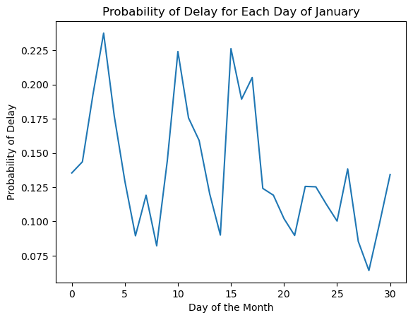
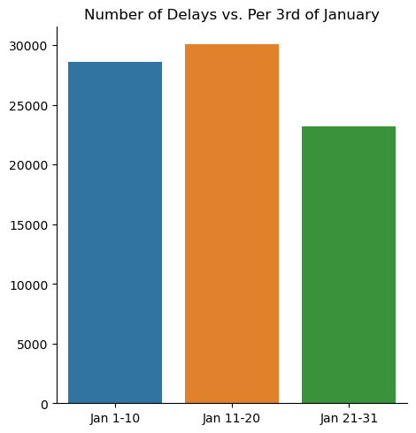
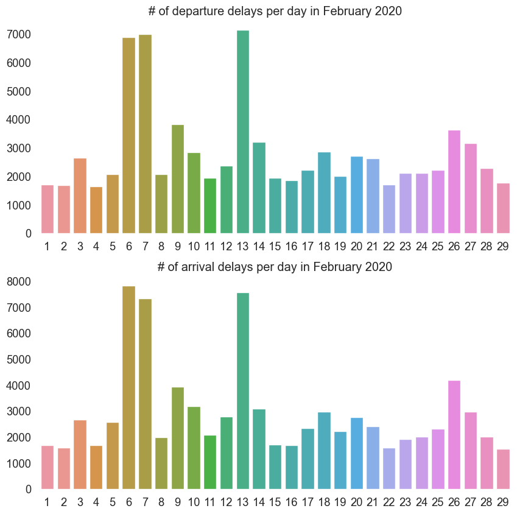
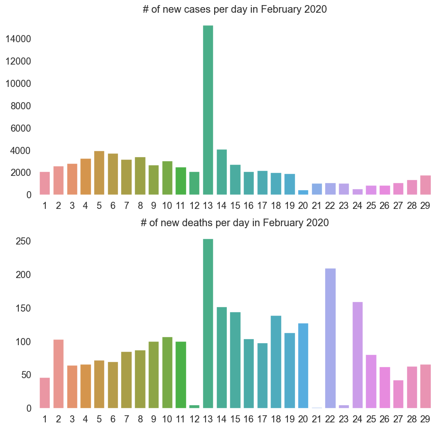
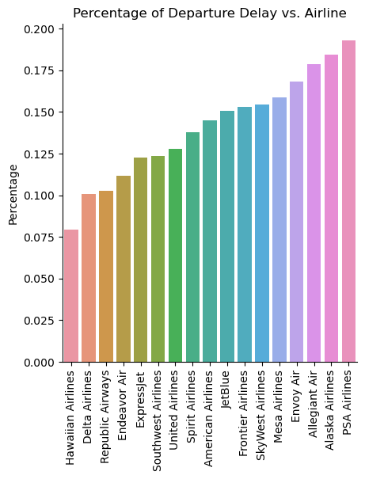
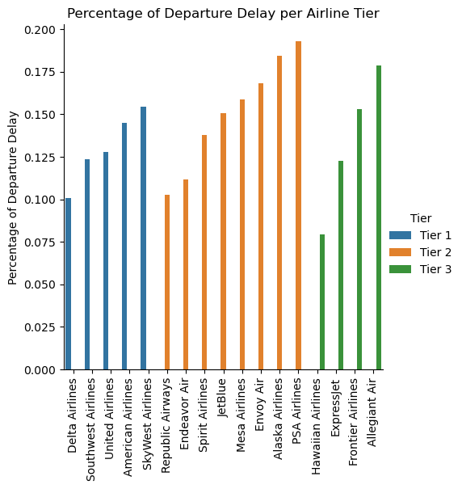
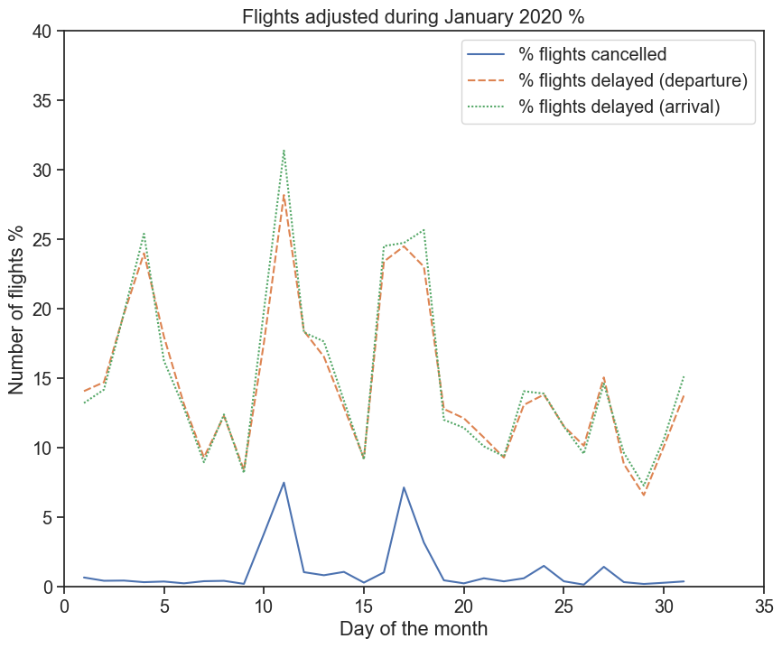
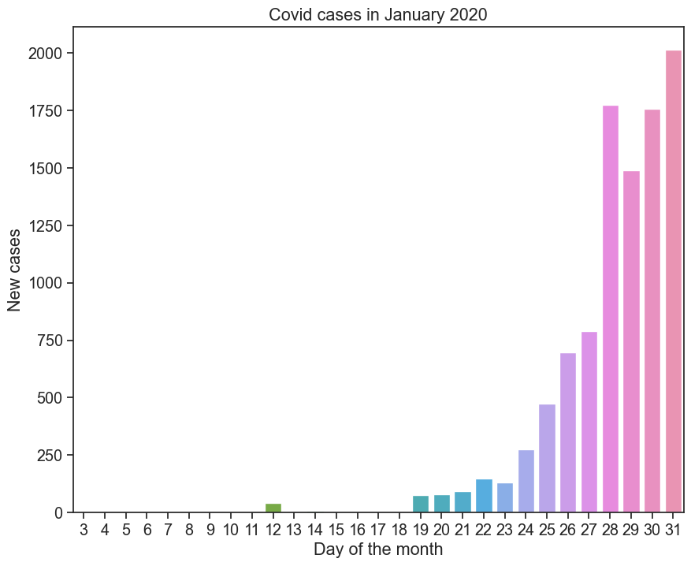
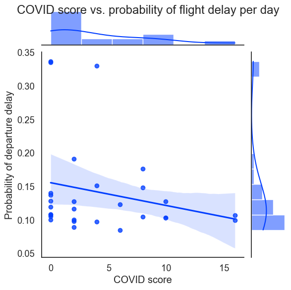
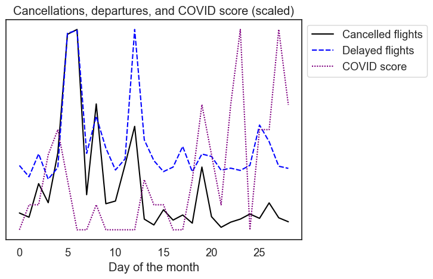

# Group 05 - Frustrated Flyers

Analyzing COVID-19's impact on commercial airlines and their passengers.

### Introduction

We are the Frustrated Flyers, and our purpose is to better understand flight disruptions through data analysis. By doing this, we hope to provide airline passengers with a better understanding of the other factors that relate to flight cancellations and flight delays. After the country experienced large amounts of flight disruptions this past winter, we believed it to be important to dive deeper into the airline industry and find the causes of travel disruptions and deliver solutions on how to avoid them.

In this project, we analyzed U.S. Government flight data near the beginning of the pandemic (January - February 2020). We also incorporated OpenFlights airport location data and WHO daily cases and deaths to see the data in context of the ongoing pandemic.

### Exploratory Data Analysis

Firstly, we analyzed the probability of a departure delay, arrival delay and cancellations for each day of January 2020. This provides information about which parts of the month are better for traveling in terms of travel disruptions.

The probability of a delay or cancellation at the start of the month was varied. There were 3 significant spikes in delays and 2 significant spikes in cancellations. The first skip — with little to no increase in cancellations — occurred on the 4th followed by the other spikes on the 11th and 17th of January.

We can see after the 20th of January there was a significant drop in the daily percentage rate of experiencing a departure delay. This may suggest that traveling in the latter part of the month is a better option to reduce travel disruptions. Next, lets take a look at the total number of delays in the month and check if it correlates with our findings above.

As we can see, the total number of delays had dropped by the last 10 days of January. This agrees with our daily percentage graph above, and it furthers the finding that, if a traveler wants to pick dates that will see the least amount of delays, they should choose a date later in the month.

We repeated the analysis of departure and arrival delays for February 2020, and we found that arrival and departure delays were correlated in this month as well.

This graph shows a few spikes. For more information, we looked into COVID-19 cases throughout February 2020 as well, and the curve was relatively smooth with a few major spikes. There were a few major dips and spikes as well that may have been due to reporting errors.

Some of the spikes between these graphs occur near similar times. This suggests that the two curves might be related.

### Which airline handled departure delays the best during January 2020?

Our dataset contains data on 17 unique airlines flying around 600,000 flights during the month of January in 2020. We also have access to which flights were delayed and so we simply graphed the percentage of a departure delay for each airline. 

This bar visualization provides information on which airlines were able to manage departure delays by showing the percentage of a departure delay. However, this graph may not take into account the number of total flights flown and could show bias to smaller airlines. Next, let's split up the airlines into 'tiers' so that we can compare airlines against their respective competition. In this case, we split up airlines based on how many total flights were flown during the month with tier 1 being the most popular followed by tier 2 and then tier 3.

This grouped bar plot allows us to split up airlines into groups with other airlines that fly similar amount of flights each month. Therefore, we are able to look at the percentages of departure delays for each airline against their similar counterparts. We can see that among the most popular airlines, Delta was able to show a lower percentage of a delay. In the middle-tier airlines, Republic and Endeavor put up significantly lower percentages of departure delays. Lastly, among the least-popular airlines, Hawaiian had the lowest percentage of a delay (as well as among any airline).   

Now, we are able to provide information to travelers who are seeking to travel on a specific airline tier in order to help guide them into choosing a specific airline that will cause the least travel disruption.

### Airline decision making in January 2020

COVID-19 was first detected in the U.S in January of 2020. To find out if it affected flights within the U.S we calculated the percentage chance of a flight getting delayed on arrival, departure and getting canceled.

We found out early that delays on arrival and departure had a very similar pattern and therefore used only departure in the following month. We further had graph displaying the daily and cumulative COVID-19 cases within the month.

Spikes in delays and cancellations directly corresponded to initial COVID-19 cases and deaths. Towards the end of the month,  there was a exponential increase in cases but a overall decrease the number of delays. Even though, there is a decrease we can make a educated assumption that COVID-19 is the reason for the spikes in cancellations and delays in airlines during January 2020.

### Airline decision making in February 2020

By February, the daily COVID-19 reports picked up, so we performed a separate analysis to account for the potentially larger role that they might play in flights.

To do this, we calculated a _COVID score_ for every flight by summing the number of new daily cases between the origin and destination countries. The dataset almost entirely consists of domestic United States flights, so the COVID score is largely determined by the US COVID-19 case counts, but it is still useful for roughly estimating the risk of international flights.

Notably, we found that flights may be more likely to be delayed on days with lower COVID scores as shown by the graph below.

However, more importantly, we also found that spikes in delays and cancellations generally corresponded with spikes in the COVID score as shown by the graph below, and that flight delays and cancellations became smoother as the month progressed.

The spikes in delays and cancellations occur quite  closely to the spikes in the COVID score, and the delays and cancellations become smoother over time. This indicates that airlines took less drastic reactions to COVID-19 events later in the month, and that they may have gotten better at handling it.

In any case, it clear that airline decision making was related to the number of new COVID-19 cases during February 2020.

### Conclusion

To summarize, certain airlines handled delays better than others during January 2020 with Hawaiian Airlines being the airline with the lowest probability of delay.

The decisions of airlines were also _definitely_ affected by COVID-19 throughout January and February 2020 as indicated by the cancellation and delay spikes roughly lining up with the WHO's COVID-19 statistics.

These findings might be of use to people hoping to predict flight delays during pandemics.

The code for our analysis is available in [./analysis](./analysis). We also have dashboards available in [./dashboard](./dashboard), but running them requires a Tableau Desktop license and a Windows or MacOS installation. We also provide a walkthrough of our dashboards in [this video](https://www.youtube.com/watch?v=_aQ1W5y54HM).

### Team

- Aakash Tirathdas
- Bradan Fleming
- Kaiden Merchant

### References  

* [January Flight Delay Prediction](https://www.kaggle.com/datasets/divyansh22/flight-delay-prediction)
    * License: [U.S. Government Works](https://www.usa.gov/government-works/)
* [February Flight Delay Prediction](https://www.kaggle.com/datasets/divyansh22/february-flight-delay-prediction)
    * License: [U.S. Government Works](https://www.usa.gov/government-works/)
* [Daily cases and deaths by date reported to WHO](https://covid19.who.int/data)
    * License: [CC BY-NC-SA 3.0 IGO](https://creativecommons.org/licenses/by-nc-sa/3.0/igo/)
* [OpenFlights extended airport data](https://openflights.org/data.html)
    * License: [ODbL 1.0](https://opendatacommons.org/licenses/odbl/1-0/)

---

"Flight data analysis? I don't know a lot about airplanes, so I'll have to wing it." :^)